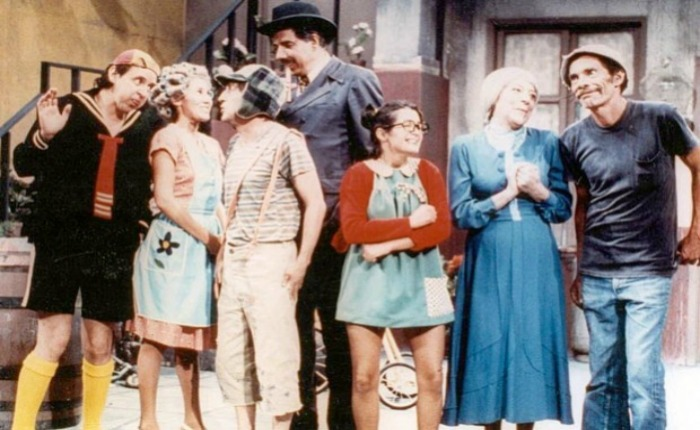

<meta charset="utf-8" emacsmode="-*- markdown -*-">

     **Xilenial Discovers Perseverance**

October 6th, 2024
By Alejandro Garcia

> "Most people overestimate what they can do in one year
> and underestimate what they can accomplish in ten years.
>
>      -- Bill Gates

Here in Mexico we have a meme:

When the idea of co-living became famous.
Millenials re-discovered the vecindad.

A place where multiple families live in the same building,
sharing services and central garden.

## Well I have a similar experience.

As you know for the past month.
I have been slowly reading and transcribing the book:

[Object Structures](https://openlibrary.org/books/OL811478M/Object_structures)

Which I think is the best book on Data Structures I have ever read.
I wish I had read it when It was first published.

The thing is that the book has 469 pages.
And currently, I have only translated all the way to chapter 4.
So only page 84.

With my slow progress, sometimes, I have felt that It will take me for ever to finish the book.

However, yesterday while working on the last page.

It downed on me, it is *inevitable* that will finish transcribing that book!
It felt like an important insight.
Yet after thinking on the insight for more than 5 seconds.

> I realized, I just had rediscovered **perseverance**

So not a new insight at all.

yet, How come I think I'll finish this goal.
When I have failed with so many others?

# Have systems not goals.

As you know one of my favorites ideas from the book Atomic Habits is;

> Have systems, not goals
> -- James Clear

So the system that I setup.
To make finish this, inevitable is that I have setup as goal in Beeminder that I'll have 10 lines of code **inside** markdown files.
So that way I force myself to translate the markdown and the code.
But the goal is NOT specific to say 500 words of text.
Instead it is 10 lines of code daily, inside markdown files.
So sometimes in code heavy chapters I can reach that goal very easily.
But in other chapters I need to transcribe a lot of text, before actually reaching the 10 lines of code.
So that keeps the goal a little bit variable.
Enough to not make it boring.

With this system.
It seems it is **inevitable** that I'm going to finish transcribing that book.
and you know what.
In this uncertain world, knowing that I'm going to finish something.
feels pretty good!

<!-- Markdeep: -->
